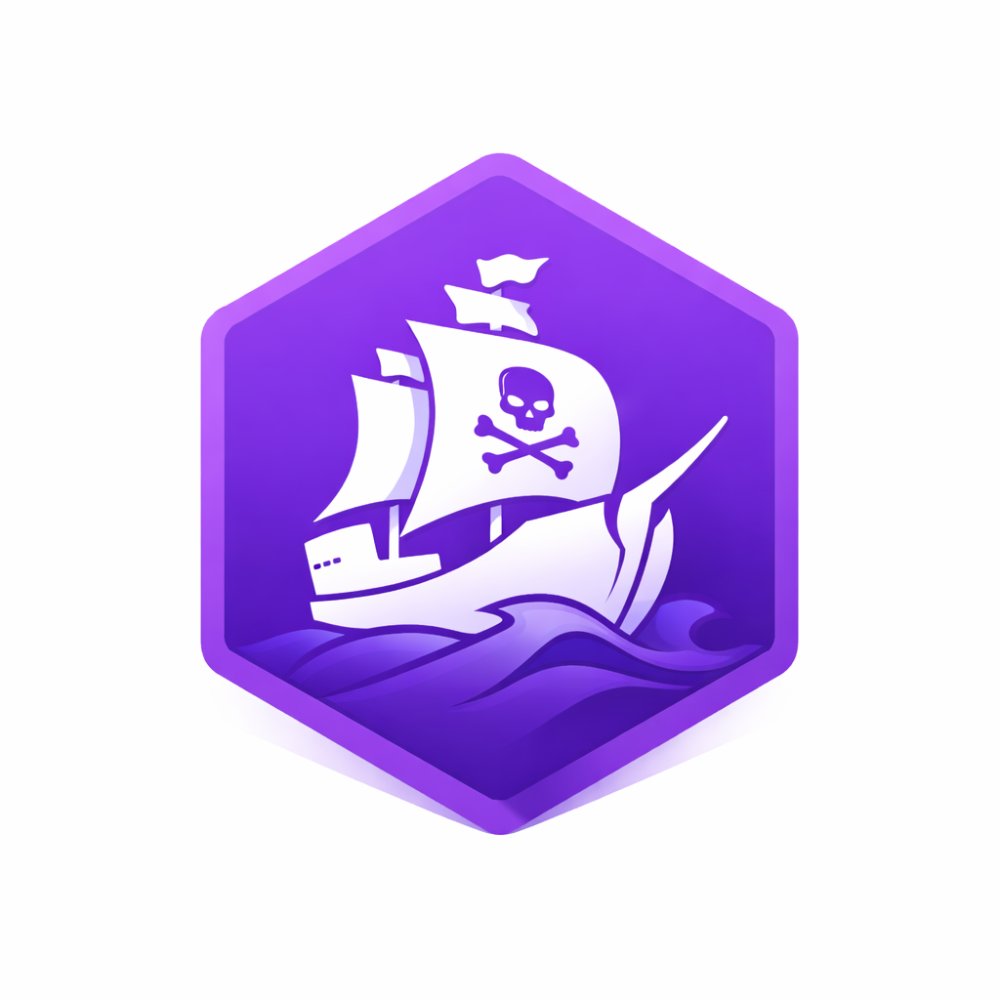

<p align="center">
  
</p>

# worph

[](https://github.com/wordlift/worph/actions/workflows/ci.yml)
[](https://pypi.org/project/worph/)
[](https://github.com/wordlift/worph/blob/main/pyproject.toml)
[](LICENSE)

`worph` is a public project at [`wordlift/worph`](https://github.com/wordlift/worph), forked from [`morph-kgc`](https://github.com/morph-kgc/morph-kgc). It keeps compatibility with retained `morph_kgc` imports while evolving the primary implementation under `src/worph/`.

## Table of Contents

- [Overview](#overview)
- [Repository Layout](#repository-layout)
- [Quick Start](#quick-start)
- [CLI Commands](#cli-commands)
- [Testing](#testing)
- [Compatibility](#compatibility)
- [Documentation](#documentation)
- [Release](#release)
- [License](#license)

## Overview

`worph` provides RML/YARRRML materialization flows with compatibility for existing `morph_kgc` consumers. The codebase includes regression suites and compatibility shims used in CI to validate behavior against retained tests.

## Repository Layout

- `src/worph/`: primary package implementation
- `.ci_shims/morph_kgc/`: compatibility shim re-exporting from `worph`
- `test/`: regression and issue-driven test suites
- `examples/`: runnable configs and sample scripts
- `specs/`: compatibility, playbook, and agent-guidance documents
- `specs/agents/`: specialist subagent briefs used during planning/review
- `docs/`: operational documentation

## Quick Start

```bash
uv sync --extra test
uv run python -m worph examples/csv/config.ini
```

## CLI Commands

Run using the package entrypoint:

```bash
uv run worph examples/json/config.ini
```

Equivalent module form:

```bash
uv run python -m worph examples/xml/config.ini
```

## Testing

Run full CI-aligned tests with shim compatibility enabled:

```bash
PYTHONPATH=.ci_shims:src uv run pytest -q
```

Run the explicit shim validation test:

```bash
PYTHONPATH=.ci_shims:src uv run pytest -q test/test_ci_shim_uses_worph.py
```

## Compatibility

Some retained tests still import `morph_kgc`. CI sets `PYTHONPATH=.ci_shims:src` so imports resolve to `.ci_shims/morph_kgc` first, then delegate to `worph`.

## Documentation

- [docs/compatibility-shims.md](docs/compatibility-shims.md)
- [specs/COMPATIBILITY.md](specs/COMPATIBILITY.md)
- [specs/lessons-learned.md](specs/lessons-learned.md)

## Release

Publishing to PyPI is handled inside `.github/workflows/ci.yml`.

- Trigger: push a version tag like `0.1.4` or `v0.1.4`
- Gate: `publish` job runs only after `test-and-examples` succeeds
- Auth: PyPI Trusted Publisher (OIDC)

Trusted Publisher settings on `pypi.org`:

- Owner: `wordlift`
- Repository: `worph`
- Workflow name: `ci.yml`
- Environment: empty (unless you add one in GitHub)

## License

All code and documentation in this repository are licensed under the Apache License 2.0.
